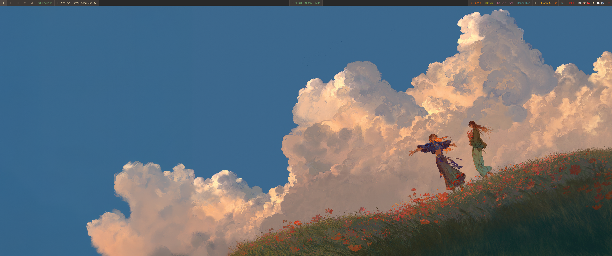
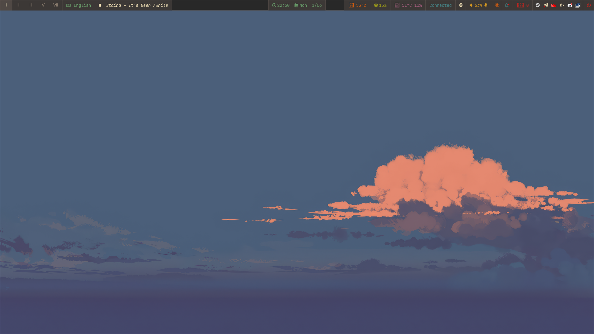
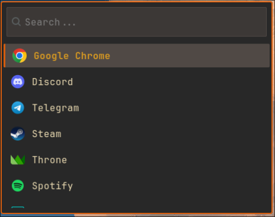

# .dotfiles

My configuration files for an **Arch Linux** based system with the **Hyprland** tiling window manager.

## Screenshots

| [](./screenshots/screen1.png) | [](./screenshots/screen2.png) |
|:---:|:---:|
| **Workspace 1** (Hyprland) | **Workspace 2** (Hyprland) |

| [](./screenshots/waybar.png) | [](./screenshots/wofi.png) |
|:---:|:---:|
| **Waybar** (Status Bar) | **Rofi / Wofi** (App Launcher) |

---

## Configuration Overview

*   **Hyprland**: A dynamic Wayland tiling compositor that provides smooth animations and flexible window management.
*   **Waybar**: A highly customizable status bar displaying system info, network connectivity, and media player status.
*   **Rofi/Wofi**: Minimalist menus for quick application launching and window switching.

---

## Installation

[GNU Stow](https://www.gnu.org/software/stow/) is used for managing the configurations.

```bash
git clone https://github.com/JustYarick/.dotfiles.git ~/.dotfiles
cd ~/.dotfiles
stow .
```

> Many packages are installed from the **AUR** — using `yay` is recommended.

---

## Package List

| Package | Description | Source |
|:---|:---|:---|
| **System Components** | | |
| `nvidia-open` | NVIDIA open kernel modules | official |
| `nvidia-settings` | GPU settings control panel | official |
| `libva-nvidia-driver` | Hardware video acceleration (VA-API) | AUR |
| **Shell and Window Manager** | | |
| `hyprland` | Main tiling WM (Wayland) | official |
| `ly` | TUI Display Manager — login screen | AUR |
| `uwsm` | Universal Wayland Session Manager | AUR |
| `xdg-desktop-portal-hyprland` | System portals: screenshots, screen sharing | official |
| `polkit-kde-agent` | Polkit authentication agent | official |
| `waybar` | Status bar (scripts in `.config/waybar/custom_modules/`) | official |
| `swaync` | Notification center (SwayNC) | AUR |
| `wofi` | Application launcher (Wayland-native) | official |
| `rofi` | Alternative launcher and window switcher | official |
| `hyprlock` | Screen locker for Hyprland | official |
| `hypridle` | idle | official |
| `wlogout` | Session logout menu | AUR |
| `power-profiles-daemon` | change CPU power mode | official |
| **Terminal and Environment** | | |
| `ghostty` | Main terminal emulator | AUR |
| `kitty` | Alternative terminal emulator | official |
| `zsh` | Main shell | official |
| `oh-my-zsh` | Zsh configuration framework | external |
| `powerlevel10k` | Zsh theme (installed as an OMZ plugin) | external |
| `tmux` | Terminal multiplexer | official |
| `fastfetch` | System info tool (alias: `ff`) | official |
| **Audio and Multimedia** | | |
| `pipewire` | Main audio server | official |
| `pipewire-pulse` | PulseAudio-compatible layer for PipeWire | official |
| `pipewire-alsa` | ALSA-compatible layer for PipeWire | official |
| `wireplumber` | Session manager for PipeWire | official |
| `easyeffects` | Audio processing and tuning | official |
| `lsp-plugins` | Audio filters for EasyEffects | official |
| `rnnoise` | Neural network noise reduction for EasyEffects | official |
| `playerctl` | Media player control from status bar | official |
| `helvum` | PipeWire audio stream graph | official |
| **File Management and Wallpapers** | | |
| `yazi` | Terminal file manager | official |
| `nautilus` | GUI file manager | official |
| `waypaper` | GUI wallpaper manager | AUR |
| `awww` | Wallpaper backend: GIF animation | AUR |
| `mpvpaper` | Wallpaper backend: video | AUR |
| `hyprshot` | Screenshot tool (grim + slurp wrapper) | AUR |
| `grim` | Screen capture for Wayland | official |
| `slurp` | Interactive screen region selection | official |
| **Editors** | | |
| `neovim` | Main editor (LazyVim distribution) | official |
| `zed` | Alternative editor / IDE | official |
| **Containerization** | | |
| `docker` | Application containerization | official |
| `docker-compose` | Multi-container orchestration | official |
| **Languages and Runtimes** | | |
| `nodejs` | JavaScript runtime (Node.js) | official |
| `npm` | Node package manager | official |
| `angular-cli` | CLI for Angular projects | npm |
| `pyenv` | Python version manager | AUR |
| `python-pip` | Python package manager | official |
| `mongodb-bin` | MongoDB database | AUR |
| `mongodb-tools-bin` | MongoDB utilities (mongodump, mongorestore, etc.) | AUR |
| **Git** | | |
| `git` | Version control system | official |
| `lazygit` | TUI client for convenient Git workflow | official |
| **Network and Security** | | |
| `networkmanager` | Network connection management | official |
| `network-manager-applet` | NetworkManager tray applet | official |
| `ufw` | Uncomplicated Firewall | official |
| `v2ray-bin` | V2Ray proxy core | AUR |
| `throne-bin` | Proxy / VCS tool | AUR |
| **Browsers** | | |
| `google-chrome` | Main browser | AUR |
| `firefox` | Secondary browser | official |
| `brave-bin` | main browser | AUR |
| **Messaging and Communication** | | |
| `telegram-desktop` | Telegram messenger | official |
| `com.discordapp.Discord` | Discord with auto-updates | Flatpak |
| `teamspeak3` | TeamSpeak 3 voice chat | AUR |
| `teamspeak` | TeamSpeak 6 beta version | AUR |
| **Gaming** | | |
| `steam` | Valve's gaming platform | official |
| `gamescope` | Micro-compositor for gaming (HDR, upscaling) | official |
| **Utilities** | | |
| `obs-studio` | recording and streaming | official |
| `spotify` | Music streaming | AUR |
| `localsend-bin` | Local network file transfer (AirDrop alternative) | AUR |
| `onlyoffice-bin` | Office suite (.docx/.xlsx compatibility) | AUR |
| `timeshift` | System snapshots and backups | AUR |
| `cups` | Printing system | official |
| `vlc-plugins-all` | vlc support | official |
| **Fonts and Theming** | | |
| `ttf-jetbrains-mono-nerd` | Main monospace font with Nerd Icons | official |
| `noto-fonts` | Universal font set | official |
| `noto-fonts-cjk` | CJK support: Chinese, Japanese, Korean | official |
| `noto-fonts-emoji` | Emoji support | official |
| `woff2-font-awesome` | Font Awesome in WOFF2 format (for Waybar) | AUR |
| `adwaita-icon-theme` | Adwaita icons and cursors | official |

---
